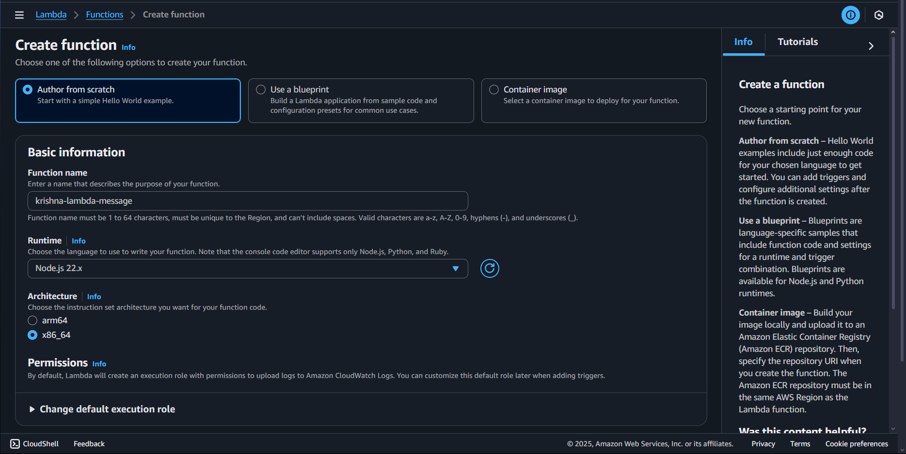
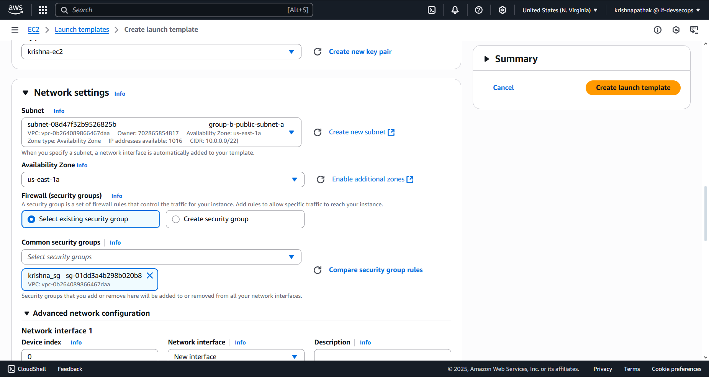

#### 1. Single-Container Deployment (Type: Fargate)

- Create an ECS Cluster
- Define a Task Definition for your BE Application(from previous assignment)
- Launch an ECS Service:
- Deploy the task definition as an ECS service and ensure it's running successfully.

**_Answer:_**

- Created an ECS Cluster named `cluster-krishna`.
- Chose the Fargate infrastructure in the cluster

- Chose the container insights option to monitor the cluster.

- Added tags to the cluster.

- The cluster was created successfully.

- Created Task Definition with Fargate launch type. It uses the `awsvpc` mode by default by the AWS Fargate launch type.

Task Definition again

---

