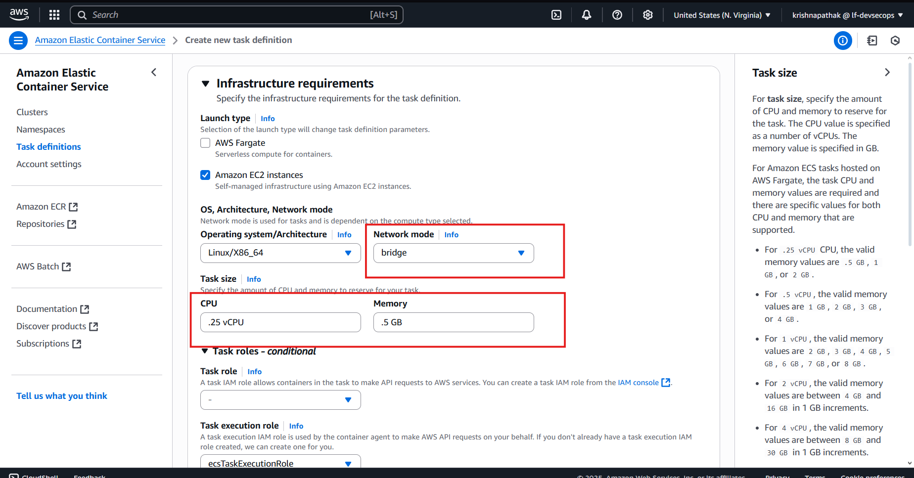
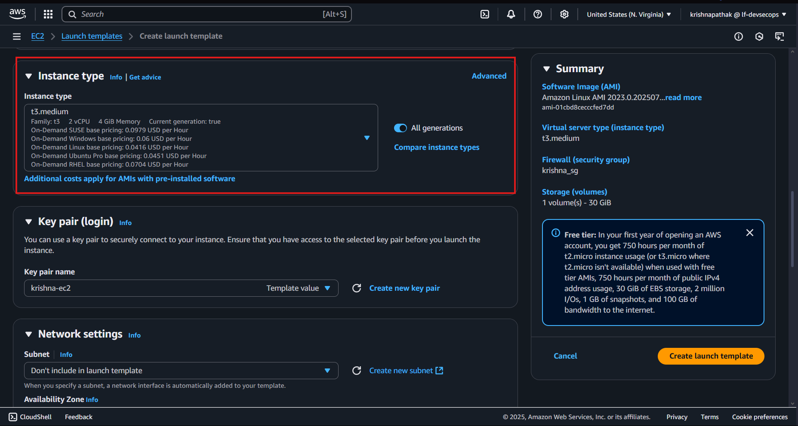
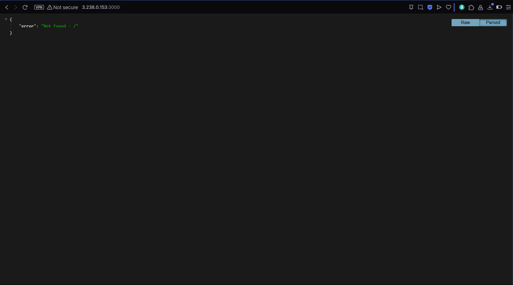

# Assignment:

#### 1. Single-Container Deployment (Type: Fargate)

- Create an ECS Cluster
- Define a Task Definition for your BE Application(from previous assignment)
- Launch an ECS Service:
- Deploy the task definition as an ECS service and ensure it's running successfully.

**_Answer:_**

- Created an ECS Cluster named `cluster-krishna`.
- Chose the Fargate infrastructure in the cluster


- Chose the container insights option to monitor the cluster.


- Added tags to the cluster.


- The cluster was created successfully.


- Created Task Definition with Fargate launch type. It uses the `awsvpc` mode by default by the AWS Fargate launch type.


- The task definition was given 1 vCPU and 3 GB of memory.


- The container was created `backend` and the image is `jhinga/backend-1:latest-2`.


- The container port is set to 3000 since the backend application runs on port 3000.


- The task definition was created successfully.


- The task definition was created with the fargate launch type and the awsvpc network mode.


- The task definition had one container backend1.


- Navigated to the ECS service and created a new service.


- Chose the created task definition and the launch type as Fargate.


- The desired number of tasks is set to 1 which means one task will be running even if one task fails.


- The vpc was selected of my group and the public subnets were selected.

- The security group was selected that allows inbound traffic on port 3000.


- The service was created successfully.


- The service was active and the task was running but I had given a wrong docker image name so the task was not running.


- Created a new task definition revision with the correct docker image name.


- Updated the ECS service to use the new task definition revision and the task was running successfully.


- The public IP of the task was used to access the backend application.


- At / the backend threw an error not found.


- I had created an api endpoint /backend which returns a message which was running successfully.


- I tried to stop the task but it was running again since the desired number of tasks is set to 1.


- So I updated the service to 0 desired tasks and the task was stopped.


---

#### 2. Single-Container Deployment (Type: EC2 / EC2 Spot)

- Create an ECS Cluster
- Create Launch Template & ASG Manually
- Use ASG as an capacity Provider
- FE Application(from previous assignment) (Bridge Mode: Should get a Public IP)
- Deploy the task definition as a single task and ensure it's running successfully.

**_Answer:_**

- Navigated to the Launch Templates and created a new launch template.


- The launch template was created and i selected the auto scaling guidance.


- I chose the AMI as Amazon Linux and the instance type as t2.micro.


- I then selected the existing security group which allows inbound traffic on port 80.


- The launch template was created successfully.


- I then created an Auto Scaling Group with the launch template.


- I chose the VPC of my group and the public subnets.


- I configured the auto scaling group to have a minimum of 1 instance and a maximum of 21 instance mistakenly. Later I changed it to 3.


- Added the tags to the auto scaling group.


- The auto scaling group was reviewed and created successfully.


- I then created an ECS cluster with the EC2 launch type.


- I chose the Amazon EC2 infrastructure option where I chose the auto scaling group as the capacity provider.


- The cluster was created successfully.

- A new task definition was created with the bridge network mode and the cpu was set to 1 vCPU and 2 GB of memory.


- The container was created with the image `jhinga/frontend:latest` and the port of the container and the host was set to 80.


- I also created a new service with the task definition and the capacity provider as the auto scaling group.


- The task was in provisioning state and was not running.


- I used the instance public IP to manual ssh into the instance and check the logs.


- **_I realized my mistakes while creating the launch template. I had not selected the ami that was ECS optimized. I also had not included the user data script to configure the ECS agent._**

- I used the key pair created in the launch template to ssh into the instance.


- I installed docker in the instance.


- **_I also had forgot to add the IAM instance profile for the EC2 container service._**


- I started docker service inside the instance.


- I then installed the ecs agent in the instance.


- I then included the cluster name in the ecs config file.


- The ECS agent was running successfully but the task was still not running.


- **_I then realized that I had created the task definition with 1 vCPU and 2 GB of memory but the instance type was t2.micro which has only 1 GB of memory._**

---

## Final Workflow of Task 2:

1. **_First, I created the cluster without any infrastructure._**


2. **_Then I created the launch template where i selected the ECS optimized AMI._**


- I chose the instance type as t2.micro.


- Selected the existing security group which allows inbound traffic on port 80.


- I also enabled auto assign public IP and added the IAM instance profile for the ECS container service.


- Then used the user data script to include the ECS cluster into the config file.

```bash
#!/bin/bash
echo ECS_CLUSTER=krishna-cluster-trying >> /etc/ecs/ecs.config
```


- The launch template was created successfully.

3. **_Then I created the auto scaling group with the launch template._**

- I chose the launch template created above.


- I then chose the VPC of my group and the public subnets.


- I then configured the auto scaling group to have a minimum of 1 instance and a maximum of 2 instances.


- The auto scaling group was created successfully.

4. **_Created a capacity provider with the auto scaling group created above and attached it to the ECS cluster._**

- Navigated to the ECS cluster and created a new capacity provider.


- The capacity provider was created with the auto scaling group.


- The capacity provider was attached to the ECS cluster.


5. **_Created a task definition with the bridge network mode._**

- Created a new task definition with the bridge network mode.

- Selected `.25` vCPU and `.5` GB of memory.



- The container was created with the image `jhinga/frontend:latest` and the port of the container and the host was set to 80.


6. **_Created a new service with the task definition and the capacity provider as the auto scaling group._**


- The capacity provider was selected as the auto scaling group created above.


- The service was created successfully and the task was running successfully.


- The public IP of the task was used to access the frontend application.


- The frontend application was accessible at `34.201.110.5`


---

### 3. Multi-Container Deployment (Type: EC2/EC2 Spot) (Bridge) (1 frontend, 1 backend)

- Create a ECS Cluster
- Create a Task Definition with multiple-container
- Create an ECS Service:
  - Deploy the task definition as an ECS service and ensure it's running successfully browsing it by its public IP
  - Use ASG On-Demand/Spot as capacity provider

**_Answer:_**

1. **_Created a new ECS cluster and selected no infrastructure._**


2. **_Created a new launch template with the ECS optimized AMI and the instance type as t3.medium._**


- Chose the instance type as t3.medium.



- Selected the existing security group which allows inbound traffic on port 80 for frontend and 3000 for backend.


- The IAM instance profile for the ECS container service was selected.


- Then used the user data script to include the ECS cluster into the config file.

```bash
#!/bin/bash
echo ECS_CLUSTER=krishna-fe-be-cluster >> /etc/ecs/ecs.config
```


- The launch template was created successfully.


3. **_Created an auto scaling group with the launch template._**

- Chose the launch template created above.


- I chose the VPC of my group and the public subnets.


- The auto scaling group was configured to have a minimum of 1 instance and a maximum of 2 instances.


- The auto scaling group was created successfully.

4. **_Created a capacity provider with the auto scaling group and attached it to the ECS cluster._**

- Navigated to the ECS cluster and created a new capacity provider.


- The capacity provider was created with the auto scaling group created earlier.


- It was successfully attached to the ECS cluster.

5. **_Created a task definition with multiple containers._**

- Created a new task definition with the bridge network mode and the launch type as EC2.


- The task definition was given 1 vCPU and 2 GB of memory.


- The first container was created with the image `jhinga/frontend:latest` and the port of the container and the host was set to 80.


- The second container was created with the image `jhinga/backend-1:latest-2` and the port of the container and the host was set to 3000.


6. **_Created a new service with the task definition and the capacity provider as the auto scaling group._**

- The task definition created above was selected while creating the service.


- The capacity provider was selected as the auto scaling group created earlier.


- The service was created successfully and the task was in provisioning state for a minute before it was running successfully.


- The public IP of the task was used to access the frontend and backend applications.


- The frontend application was accessed using the public IP `3.238.0.153`.


- The backend application was also accessed using the public IP and the port 3000.

At / it threw an error not found.



- At /api/users it returned database error since the database is not connected.


The multi-container deployment was successful with one frontend and one backend container running in the same task.

---

#### 4. What are the placement strategies in the AWS ECS? Explain briefly. At last compare which strategy should be used in which scenario.

**_Answer:_**

[Reference to placement strategies](https://docs.aws.amazon.com/AmazonECS/latest/developerguide/task-placement-strategies.html)

Placement strategies in AWS ECS are used to determine how tasks are placed on container instances within a cluster.

A task placement strategy is an algorithm for selecting instances for task placement or tasks for termination. When a task that uses the EC2 launch type is launched, Amazon ECS must determine where to place the task based on the requirements specified in the task definition, such as CPU and memory.

Task placement strategy types:

1. **Spread**: This strategy spreads tasks across available instances based on specified attributes (e.g., instance ID, availability zone). It is useful for maximizing availability and fault tolerance.

2. **Binpack**: This strategy places tasks on the least utilized instances based on specified resource requirements like CPU, memory. It is useful for optimizing resource utilization and reducing costs.

3. **Random**: This strategy places tasks randomly across available instances. It is useful for testing and development purposes.

The choice of placement strategy depends on the specific requirements of the application and the desired trade-offs between availability, resource utilization, and cost.

For example, a web application with high availability requirements may benefit from the spread strategy, while a batch processing application with flexible resource requirements may benefit from the binpack strategy.

---

### Bonus:

- Configure/Update the ECS Service of Q.3 so that you will be able to execute commands inside both ECS container separately.
  - e.g. aws ecs execute-command

**_Answer:_**


